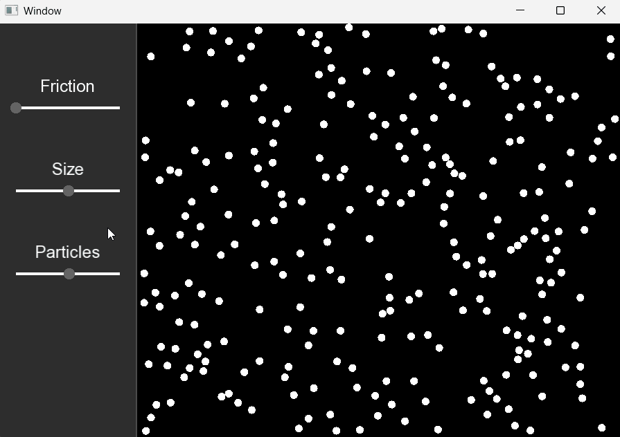

# Particle Physics Simulator



An interactive 2D particle physics simulation built in C++ using the SFML library!

## Features

* **Real-Time Elastic Collisions:** Realistic particle-on-particle, particle-on-screen, and particle-on-cursor physics with customizable momentum retention.
* **Interactive Control Panel:** A built-in UI sidebar that allows you to alter the physics with sliders and buttons.
    * **Friction:** Adjusts space resistance and energy loss.
    * **Size:** Dynamically scales the radius of all the particles.
    * **Particle Count:** Instantly increase or decrease the number of particles at any given moment.
* **Black Hole Mode:** Toggle the **black hole** feature to turn your cursor into a high-gravity center of mass with an adjustable attraction strength.

## Techniques Used

* **Spatial Partitioning:** To avoid an $O(n^2)$ brute-force collision detection method, the simulation maps particles into a 2D grid. Particles only check for collisions against neighbors in adjacent cells, significantly boosting frame rates.
* **Cursor Sub-stepping:** High-speed mouse movements can cause a cursor to teleport past particles between frames. The program divides the mouse's positional delta into 12 substeps per frame, preventing fast-moving objects from phasing through the cursor.

## How to Build & Run it

Before compiling, ensure you have the following steps completed:

### 1. Compiler Setup (MSVC)

Check by opening developer command prompt, then typing ```cl```. If it is not installed, you have two options:
- **Option A: The full IDE** -> Download the Visual Studio Community Installer and check the *Desktop Development with C++* workload. This gives you both the compiler and the code editor.
- **Option B: Standalone Compiler (lightweight)** -> If you prefer using VSCode or don't want to download the large Visual Studio IDE, go to the Visual Studio Downloads page, scroll down to **Tools for Visual Studio**, and download **Build Tools**. In the installer, check **Desktop development with C++** to get just the standalone compiler and the Windows SDK.

### 2. Dependency Setup (SFML)

1. **Download** the Simple and Fast Multimedia Library (SFML) version ```3.0.2``` at [sfml-dev.org/download/sfml/3.0.2/](https://www.sfml-dev.org/download/sfml/3.0.2/)

2. **Link the libraries** by navigating to ```Linker -> Input -> Additional Dependencies``` and append the following ```lib``` files to the list:
    - ```sfml-graphics.lib```
    - ```sfml-window.lib```
    - ```sfml-system.lib```

3. **Navigate** to your extracted ```SFML-3.0.2/bin``` folder. Copy ```sfml-graphics-3.dll```, ```sfml-window-3.dll```, and ```sfml-system-3.dll``` and paste them directly into the folder where your compiled ```.exe``` file sits (usually in ```x64/Release```).

### 3. Required Font Asset

Because the UI requires text rendering, you must place a copy of ```arial.ttf``` directly into the projects working directory (the same folder where you compiled executable (```.exe``` file) is generated).

### 4. Running the Application

Once compiled, you can run the executable directly from your IDE (by pressing ```F5``` in Visual Studio) or via the command line:

1. Open your terminal or command prompt.
2. Navigate to the directory containing your compiled `.exe` (e.g., `x64/Release`).
3. Execute the binary:
   ```cmd
   particle-physics.exe
   ```